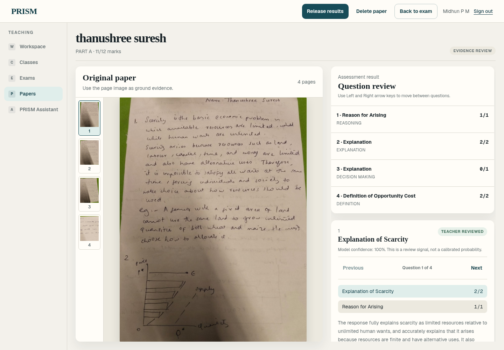
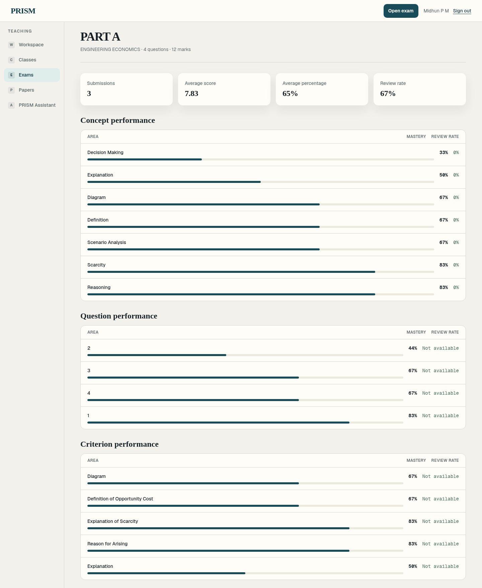
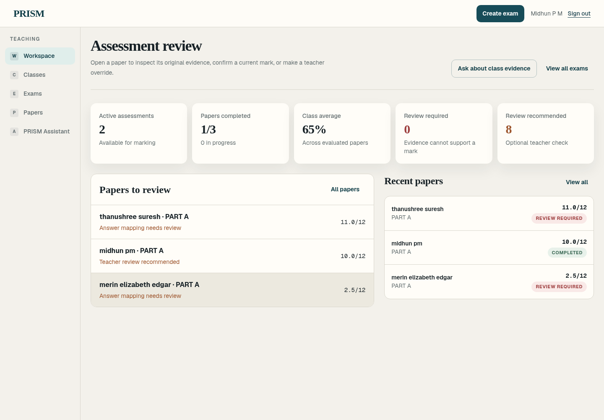
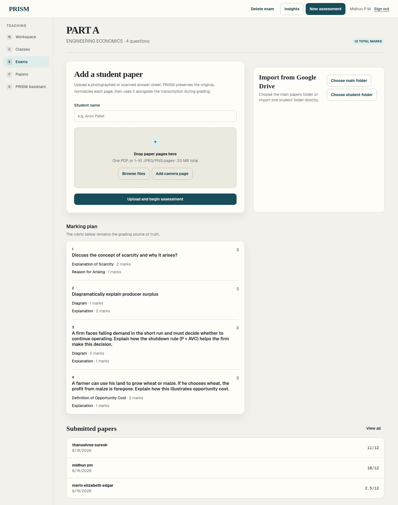

# Rubriq — Assessment Intelligence Platform

> AI-powered examination evaluation, rubric formulation, evidence review, and learning intelligence platform.

## Overview

**Rubriq** is an AI-powered assessment intelligence platform designed to reduce the heavy manual workload involved in evaluating student examination papers while keeping educators firmly in control of the final assessment. 

The platform seamlessly connects the complete end-to-end assessment lifecycle:

$$\text{Question Paper} \longrightarrow \text{Answer Key} \longrightarrow \text{Rubric} \longrightarrow \text{Student Papers} \longrightarrow \text{AI Evaluation} \longrightarrow \text{Evidence Review} \longrightarrow \text{Results} \longrightarrow \text{Learning Insights}$$

Going far beyond conventional grading tools, Rubriq bridges assessment with peer growth through its **Campus Knowledge Network**, directly connecting students' identified conceptual weaknesses with institutionally-verified senior students, faculty, and peer mentors who can guide them.

---

## Problem Statement

* **Massive Manual Grading Burden:** In higher education, over 80% of exams are still handwritten. Educators spend 40+ hours per assessment manually grading scripts, leading to fatigue and delayed feedback.
* **Opaque, Unactionable Scores:** Students traditionally receive only a single numerical score with little to no explanation of where or why marks were deducted.
* **Lack of Evidence & Accountability:** Automated grading tools often act as "black boxes" that hallucinate answers and lack spatial evidence, making educators reluctant to trust AI-generated evaluations.
* **Disconnected Learning Gaps:** Once grades are published, learning gaps remain unresolved. There is no institutional mechanism that connects a student's specific academic struggles to the people on campus who excel in those exact topics.

---

## Solution

Rubriq provides an evidence-first, educator-controlled evaluation engine coupled with a collaborative campus learning network:

1. **Multimodal Handwriting Perception:** Transcribes and analyzes scanned handwritten student papers using multimodal vision models, mapping mathematical derivations, steps, and diagrams.
2. **Automated Rubric Formulation:** Derives structured rubric criteria with positive mark allocations directly from teacher-uploaded question papers and answer keys.
3. **Evidence-Based Review Workbench:** Presents teachers with a side-by-side view of the original handwritten page and the transcription, quoted evidence, confidence signals, and rubric criteria, allowing instantaneous one-click overrides with full audit logging.
4. **Deterministic Learning Analytics:** Calculates concept mastery and question difficulty curves without AI hallucinations.
5. **Campus Knowledge Network ("Who Can Help Me?"):** Automatically pairs detected student concept gaps with institutionally-verified senior students and alumni mentors for anonymous Q&A and 1-on-1 guidance.

---

## Features

* **AI-Assisted Examination Evaluation:** Upload question papers and answer keys; automatically formulate evaluation rubrics; process multi-page handwritten student papers; and generate AI-assisted scores.
* **Evidence-Based Teacher Review:** Side-by-side inspection of original scanned handwriting with AI rationale and quoted text evidence; teacher mark overrides; and AI re-evaluation requests.
* **Student Portal:** Transparent view of released examination results, marks breakdown, quoted evidence, and identified concept learning gaps.
* **Campus Knowledge Network:** Institutional directory of verified senior and peer mentors; semantic mentor search based on exam concepts; anonymous doubt resolution; connection requests; and threaded messaging.
* **AI-Powered "Who Can Help Me?":** Automatically matches students struggling with specific concepts (e.g., *Probability*, *Calculus*) directly to verified campus experts.
* **Admin Verification & Institutional Trust:** Administrative dashboard to verify mentor expertise claims, audit badges, manage roles, and maintain data privacy.

---

## Tech Stack

* **Frontend:** Next.js 16 (App Router, Turbopack), React 19, Tailwind CSS v4, TypeScript
* **Backend:** FastAPI 0.115, Python 3.13, Pydantic v2, SQLAlchemy 2.0
* **Database:** PostgreSQL (Production), SQLite (Local Development), Alembic Schema Migrations
* **APIs / Services:** OpenAI API (GPT-4o Multimodal Vision & Structured Outputs), Google Drive Picker API
* **Hosting / Deployment:** Docker (Standalone multi-stage Next.js runner & unprivileged Python container), Render / AWS / GCP ready
* **Other Tools:** PyMuPDF (High-speed document rasterization), Pillow (Image processing), Biome (Formatting & linting), Pytest (Automated test suite)

---

## Codex / OpenAI Usage

During the development and operation of Rubriq, OpenAI tools, Codex, and APIs were instrumental across every stage of the project:

### 1. OpenAI APIs in the Core Product
* **Multimodal Handwriting Perception:** Leveraged OpenAI GPT-4o vision capabilities to transcribe complex handwritten mathematical derivations, diagrams, and written answers from scanned exam images.
* **Structured Rubric & Evaluation Reasoning:** Used OpenAI Structured Outputs (`response_format` schemas) to guarantee strict JSON outputs for rubric formulation, criterion-level evidence quotes, and confidence scoring.
* **Natural Language Mentor Matching:** Employs intelligent semantic detection to parse student natural queries and map them to verified mentor profiles and syllabus concepts.

### 2. Codex & AI Tools During the Hackathon Build
* **Ideation & Architecture Planning:** Formulated the evidence-first data model, relational schema (Alembic versions `0001` through `0017`), and secure role-based access control.
* **Code Generation:** Accelerated frontend Next.js component creation (responsive review workbench, interactive mentor cards, collapsible student accordions) and FastAPI endpoint handlers.
* **Debugging & Problem Solving:** Rapidly resolved complex full-stack issues, including Next.js standalone container builds, TypeScript typing across UUID models, and database migration advisory locks.
* **Testing & Quality Assurance:** Developed an automated 23-test unit suite and an end-to-end 22-step integration test simulating Student, Senior Mentor, and Admin workflows with 100% database persistence.
* **UI/UX Refinement:** Designed a modern, distraction-free aesthetic with accessible color palettes, micro-interactions, and responsive typography.

---

## Demo

### Live Demo

* **Web Application:** `https://rubriq.your-domain.com` *(Replace with your live deployment URL)*
* **API Documentation:** `https://api.rubriq.your-domain.com/docs`

#### Demo Credentials for Testing

| Role | Email | Password | What to Explore |
| :--- | :--- | :--- | :--- |
| **Institutional Admin** | `admin@rubriq.edu` | `Admin@123456` | Campus network management, approve mentor badges, institutional settings |
| **Lead Teacher** | `teacher@rubriq.edu` | `Teacher@123456` | Create exams, formulate rubrics, evaluate papers, review workbench, release marks |
| **Student (Arun)** | `arun.student@rubriq.edu` | `Student@123456` | View released exam evidence, concept breakdown, find mentors, ask doubts |
| **Senior Mentor (Arjun)** | `arjun.senior@rubriq.edu` | `Mentor@123456` | Verified mentor profile, respond to anonymous questions, manage connections |

### Demo / Pitch Video

* **Video Link:** [Watch Demo Video on YouTube / Loom](https://www.youtube.com/watch?v=REPLACE_WITH_YOUR_VIDEO_URL) *(Replace with your video link)*

```text
https://www.youtube.com/watch?v=REPLACE_WITH_YOUR_VIDEO_URL
```

---

## Screenshots

### 1. Evidence-Based Teacher Review Workbench
*Dual-pane review: inspect original handwriting on the left while reviewing AI criteria, confidence scores, and quoted evidence on the right.*


### 2. Deep Exam Analytics & Learning Insights
*Deterministic score distributions, question difficulty index, and concept mastery curves.*


### 3. Assessment & Examination Management
*Class rosters, paper upload queues, and grading lifecycle dashboard.*


### 4. Student Portal & Campus Knowledge Network
*Students inspect their released paper feedback and connect with verified mentors for targeted guidance.*

| Student Examination Feedback | Campus Knowledge Network |
| :---: | :---: |
|  | *[Add Screenshot: `docs/assets/screenshots/campus-network.png`]* |

---

## How to Run Locally

### Prerequisites
* Node.js 22+
* Python 3.13+
* Git
* OpenAI API Key *(for live paper processing & AI grading)*

### Step 1: Clone Repository & Setup Backend

```bash
git clone https://github.com/vishnupriya759285/rubriq_codex.git
cd rubriq_codex/backend

# Create and activate Python virtual environment
python -m venv .venv

# Windows:
.venv\Scripts\activate
# macOS/Linux:
source .venv/bin/activate

# Install dependencies & run schema migrations
pip install -r requirements.txt
python -m app.migrate

# Start FastAPI backend (Port 8000)
uvicorn app.main:app --reload --host 127.0.0.1 --port 8000
```

### Step 2: Setup Frontend

```bash
# In a separate terminal, navigate to the frontend directory
cd rubriq_codex/frontend

# Install dependencies
npm ci

# Start Next.js development server (Port 3000)
npm run dev
```

Open **[http://localhost:3000](http://localhost:3000)** in your browser.

---

## Additional Notes

* **Strict Security & Zero Leakage:** All `.env` and secret files are strictly excluded from git tracking (`.gitignore`) and Docker builds (`.dockerignore`). Browser authentication uses secure, HTTP-only opaque server-side sessions with CSRF protection (`X-CSRF-Token`).
* **Verified Test Coverage:**
  * **23 of 23 unit tests** passing in `pytest`.
  * **22 of 22 steps** passing in the campus network end-to-end integration test (`tests/test_campus_network_flow.py`).
  * **Next.js production build (`npm run build`)** compiles with 0 errors across all 18 application routes.
* **Future Roadmap:**
  * Support for vernacular/regional language handwriting evaluation.
  * Native LMS integration (Canvas, Blackboard, Moodle LTI 1.3).
  * Group study circles and real-time audio/video peer mentoring rooms.
